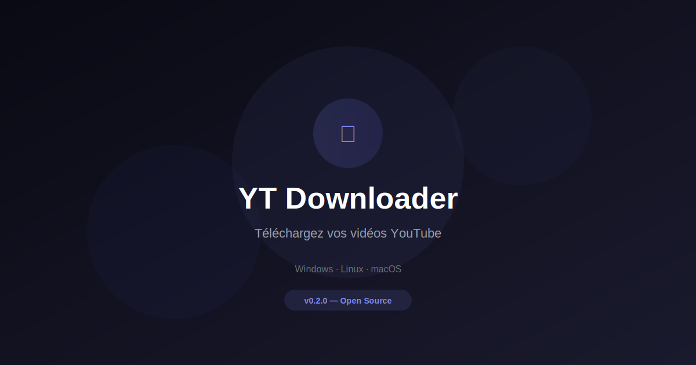

<p align="center">
  
</p>

<p align="center">
  <a href="index.html">Accueil</a> ·
  <a href="features.html">Fonctionnalités</a> ·
  <a href="download.html">Télécharger</a> ·
  <a href="changelog.html">Changelog</a> ·
  <a href="about.html">À propos</a> ·
  <a href="contact.html">Contact</a>
</p>

<p align="center">
  
  
  
  
</p>

---

## YouTube Downloader — Landing Page

Site web officiel de l'application **YouTube Downloader**. Site multi-pages déployé sur Vercel avec contact form via SMTP (Nodemailer).

> **URL :** [yt-downloader-docs.vercel.app](https://yt-downloader-docs.vercel.app)
> **Auteur :** Koffi Levis Akalete · [koffilevis21@gmail.com](mailto:koffilevis21@gmail.com)

---

## Pages

| Page | Description |
|------|-------------|
| **index.html** | Page d'accueil avec hero, features highlights, CTA |
| **features.html** | Liste complète des fonctionnalités |
| **download.html** | Téléchargement direct depuis GitHub Releases |
| **about.html** | À propos, stack technique, roadmap |
| **changelog.html** | Changelog complet v0.1.0 → v0.2.0 |
| **contact.html** | Formulaire de contact (Vercel SMTP) |

---

## Technologies

- **HTML5** — Structure sémantique multi-pages
- **CSS3** — Tailwind CSS via CDN, responsive design, dark mode auto (prefers-color-scheme)
- **JavaScript** — Navigation commune (`shared.js`), i18n FR/EN dynamique
- **Vercel** — Déploiement statique + serverless functions
- **Nodemailer** — Envoi d'emails SMTP via Gmail
- **Font Awesome 7** — Icônes

---

## Fonctionnalités du site

- **Design responsive** — Mobile-first, hamburger menu, backdrop blur
- **Dark mode** — Détection automatique `prefers-color-scheme`
- **Bilingue FR/EN** — Toggle avec sauvegarde localStorage
- **Liens de téléchargement** — Dynamiques depuis GitHub API (`releases/latest`)
- **Contact form** — Envoi server-side via Vercel, CORS géré
- **Google Analytics** — Tracking ID `G-3W35120B94`
- **OG Tags** — Open Graph + Twitter Card pour SEO

---

## Installation

```bash
# Cloner
git clone https://github.com/akaletekoffilevis/ytdownloader-landing.git
cd ytdownloader-landing

# Installer les dépendances (Nodemailer pour le contact form)
npm install

# Lancer en local
npx serve .
# ou
python3 -m http.server 8080
```

---

## Vercel

### Variables d'environnement (pour le contact form)

```
SMTP_HOST=smtp.gmail.com
SMTP_PORT=465
SMTP_USER=koffilevis21@gmail.com
SMTP_PASS=ydkv xobs uylu gifz
CONTACT_EMAIL=koffilevis21@gmail.com
```

### Deploy

Le site est déployé sur Vercel :
- **Production :** `yt-downloader-docs.vercel.app`
- **Repo :** `github.com/akaletekoffilevis/ytdownloader-landing`
- **Branch :** `main`

---

## Structure

```
ytdownloader-landing/
├── index.html          # Page d'accueil
├── features.html       # Fonctionnalités
├── download.html       # Téléchargement
├── about.html          # À propos
├── changelog.html      # Changelog
├── contact.html        # Contact
├── shared.js           # Nav + i18n + downloads partagés
├── assets/
│   └── og-image.svg    # Image Open Graph (1200x630)
├── api/
│   └── contact.js      # Vercel serverless — envoi SMTP
├── package.json        # nodemailer dependency
├── vercel.json         # Routing (rewrites)
├── .env                # Variables SMTP (gitignored)
└── README.md           # Ce fichier
```

---

## Contact

- **Email :** [koffilevis21@gmail.com](mailto:koffilevis21@gmail.com)
- **Formulaire :** [yt-downloader-docs.vercel.app/contact.html](https://yt-downloader-docs.vercel.app/contact.html)
- **GitHub :** [@akaletekoffilevis](https://github.com/akaletekoffilevis)

---

## Licence

Ce site est sous licence **MIT**.

---

<p align="center">
  Made with ❤️ by Koffi Levis Akalete · © 2026 All Rights Reserved
</p>
